# CONSUMER-COMPLAINTS

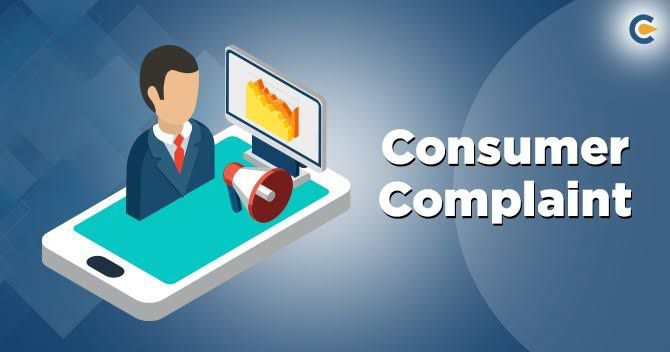

## INTRODUCTION
As a Data Analyst working for a Government Agency, I have been entrusted with a vital role. MY expertise and access to the database file "ComplaintsDB.sql" are essential for analyzing consumer complaints received by the financial institutions between the years 2013 and 2015. With my skills and insights, i will play a crucial part in uncovering valuable information and contributing to the improvement of the financial services for the benefit of the consumers.

## COUSUMER COMPLAINTS
1. Find out how many complaints were received and sent by CFPB on the same day. (Hint: 
where Date received = Date Sent)
2. Get the top 3 products that had complaints received and sent on the same day.
3. Get the top 5 issues received and sent by CFPB on the same day.
4. Get the top 5 companies targeted that the complaints were received and sent by CFPB 
on the same day.
5. Get the top 3 companies with the invest number of complaints.
6. List the two dates CFPB had the most issues received.
7. List the two dates CFPB had the lowest number of issues received.
8. Which mode of communication had the most complaints submitted with?
9. List two states with the most complaints received by CFPB.
10. Which state had the most complaints received as regards "students’ loan" in the product 
name field?
11. List two companies having the most consumer disputed as "yes"

## INSIGHTS
1. The total complaints received and sent by CFPB on the same day is;28737
 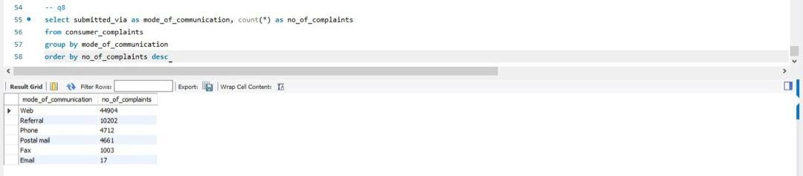

2. The top 3 products that had complaints received and sent on the same day are; mortgage 7998, Debt collection 74413, Credit reporting 5794
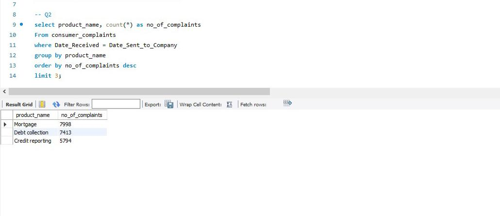

3.The top 5 issues received and sent by CFPB on the same day are; incorrect information on credit report 3799, Loan Modification,collection foreclosure 3589,loan servicing, payment, escrow account 3203, cont'd attempt collect debt not owed 3180, communication tactics 1248
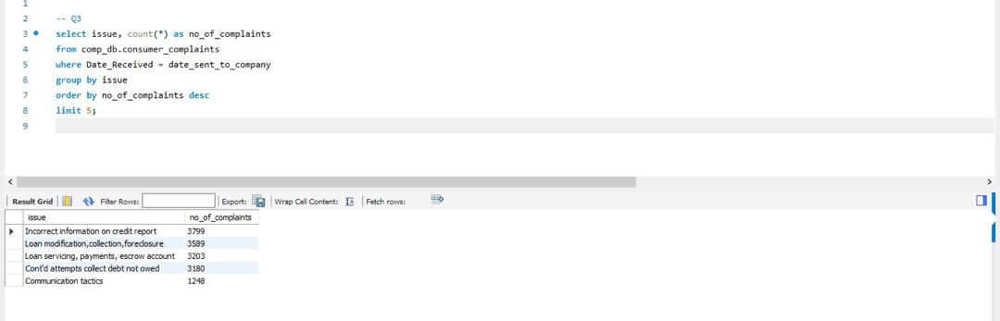

4. The top 5 companies targeted that the complaints were received and sent by CFPB 
on the same day are Equifax 2100, Experian 2002, Bank of America 1880, Wells fargo and company 1586, Transunion international holdings inc 1544
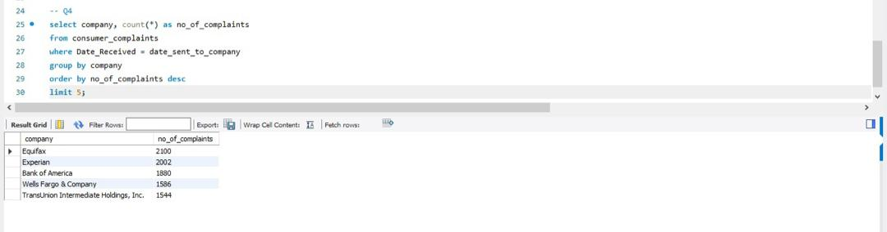

5. The top 3 companies with the invest number of complaints are;Associated mortage Corporation 1, Partners for payment relief 1, Healthcare Receivable Professionals, LLC 1.
 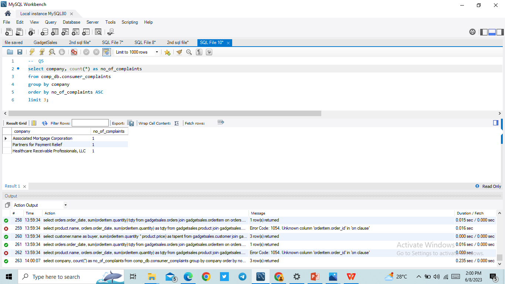

6. The top two dates CFPB had the most issues received are; June 26th 2014 and February 21st 2014
 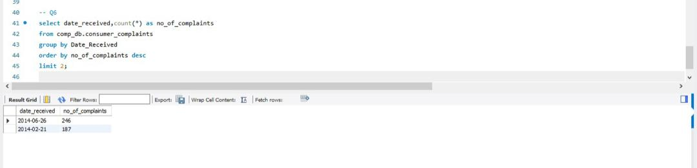

7. The top two dates CFPB had the least issues received are; September 2nd 2015 and June 5th 2015 26th
 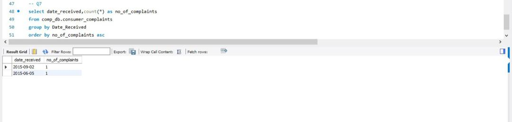

8. mode of communication which had the most complaints was submitted; web 44904
 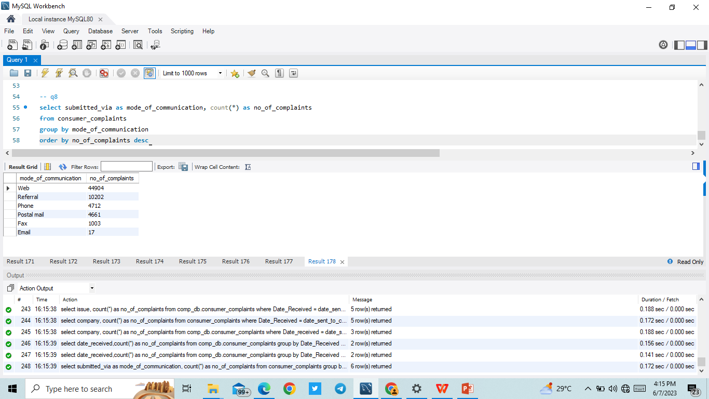

9.  The two states with the most complaints received by CFPB are;California 9255 and Florida 6306
 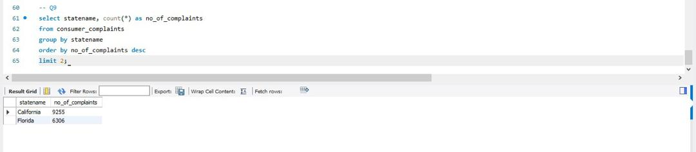

10.  The state that had the most complaints received as regards "students’ loan" in the product 
name field are; California 163
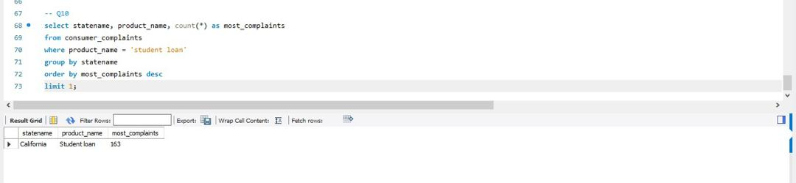

11.  The two companies having the most consumer disputed as "yes" are; Bank of America and Equifax
  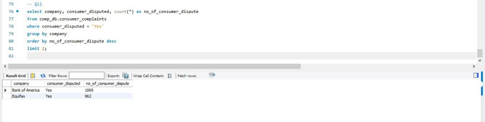

## CONCULSION
After conducting an in-depth data analysis, a significant insight has emerged regarding consumer complaints. Through careful examination of the dataset, patterns and trends have been identified, providing valuable information on the nature and characteristics of these complaints.

The conclusion drawn from the analysis of consumer complaints is that there is a prevalent issue related to the complaints. This insight highlights the need for immediate attention and action from the financial institutions to address this concern and improve their practices in order to enhance customer satisfaction.

